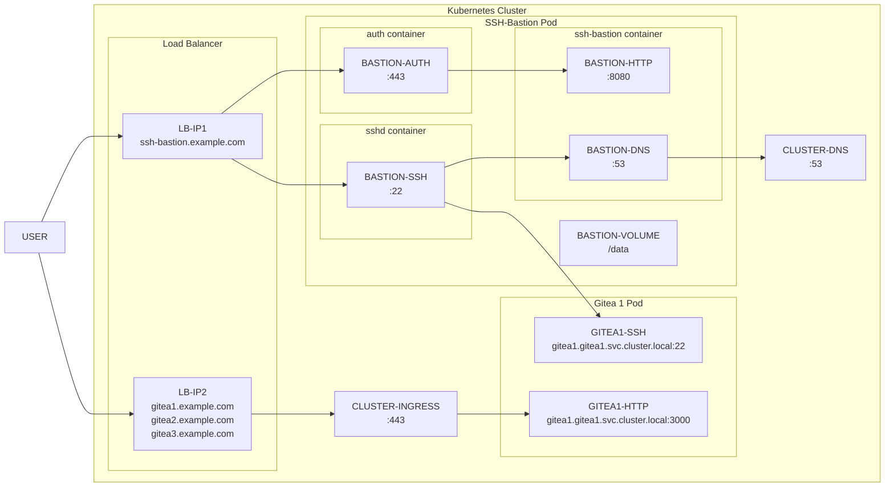

# Kompox SSH Bastion

Shared SSH bastion (OpenSSH `-J` / `ProxyJump` compatible) behind a single public IP address / LoadBalancer rule (e.g. TCP/22) + small web UI to manage SSH public keys and DNS alias rules used only by the bastion.

## Features

- SSH bastion using standard `ssh -J` / `ProxyJump`.
- Reuse a single public IP address / LoadBalancer rule (e.g. TCP/22) for many SSH targets.
- Web UI to manage SSH public keys (no private keys stored).
- Admin-only DNS alias rules for SSH targets.
- In-app DNS proxy (bastion-local) for “CNAME-like” aliasing:
    - Example: resolve `gitea1.example.com` to `gitea1.gitea1.svc.cluster.local` only inside the bastion.
    - Keeps A/AAAA dynamic (does not pin IPs), so Kubernetes Service endpoints can change without updating clients.
    - Optional hardening: return NXDOMAIN for non-aliased A/AAAA queries (default: unrestricted).

## Example use case: Gitea sites on Kubernetes

Multiplex SSH connections to multiple Gitea sites via single ssh-bastion with single public IP address and LoadBalancer rule.

This allows you to keep the external LoadBalancer rules minimal (e.g. a single SSH entrypoint on TCP/22), while selecting the target per hostname via ssh-bastion's DNS aliasing.

1. Admin registers the following DNS alias rules (public FQDN vs in-cluster service name):
    - `gitea1.example.com` -> `gitea1.gitea1.svc.cluster.local` 
    - `gitea2.example.com` -> `gitea2.gitea2.svc.cluster.local` 
    - `gitea3.example.com` -> `gitea3.gitea3.svc.cluster.local` 
    
    via the following web UI:
    - `https://ssh-bastion.example.com/admin/dns`.

2. Users register their SSH public keys via the following web UIs:
    - `https://ssh-bastion.example.com/ssh` for `jump@ssh-bastion` user
    - `https://gitea1.example.com/user/settings/keys` for `git@gitea1` user
    - `https://gitea2.example.com/user/settings/keys` for `git@gitea2` user
    - `https://gitea3.example.com/user/settings/keys` for `git@gitea3` user
3. Users connect to gitea via ssh-bastion with:
    - `ssh -J jump@ssh-bastion.example.com git@gitea1.example.com`
    - `ssh -J jump@ssh-bastion.example.com git@gitea2.example.com`
    - `ssh -J jump@ssh-bastion.example.com git@gitea3.example.com`
  
    In ssh-bastion, `giteaX.example.com` resolves via the in-app DNS proxy to the in-cluster service name `giteaX.giteaX.svc.cluster.local`.

## Architecture



You can connect `git@gitea1` via `jump@ssh-bastion` using `ssh -J`:

```bash
ssh -J jump@ssh-bastion.example.com git@gitea1.example.com
```

Example `~/.ssh/config` with more specific configurations:

```sshconfig
Host gitea1
    HostName gitea1.example.com
    User git
    IdentityFile ~/.ssh/gitea1.id_rsa
    ProxyJump ssh-bastion

Host ssh-bastion
    HostName ssh-bastion.example.com
    User jump
    IdentityFile ~/.ssh/ssh-bastion.id_rsa
```

## Developer's guide

[Design docs] reference:

- [design-overview] - Kompox ssh-bastion design overview
- [design-roadmap] - Development Roadmap
- [design-app-dns] - App DNS (in-process DNS proxy)
- [design-app-http] - App HTTP (Routes & Sitemap)
- [design-app-testing] - App Testing (HTTP + DNS)
- [design-e2e-testing] - E2E / integration testing (docker-compose + published ports)
- [design-containers] - Containers (image + runtime topology)

Prerequisites:

- Go 1.25+
- GNU Make (build + test orchestration)
- Docker and Compose (only for E2E testing; not required for app development)

See [design-app-testing] first to understand how to test the web app and DNS proxy locally.

See [design-e2e-testing] for end-to-end testing with docker-compose.

## License

[MIT License][LICENSE]

[Design docs]: ./_dev/design/
[design-overview]: ./_dev/design/design-overview.md
[design-roadmap]: ./_dev/design/design-roadmap.md
[design-app-dns]: ./_dev/design/design-app-dns.md
[design-app-http]: ./_dev/design/design-app-http.md
[design-app-testing]: ./_dev/design/design-app-testing.md
[design-e2e-testing]: ./_dev/design/design-e2e-testing.md
[design-containers]: ./_dev/design/design-containers.md
[LICENSE]: ./LICENSE